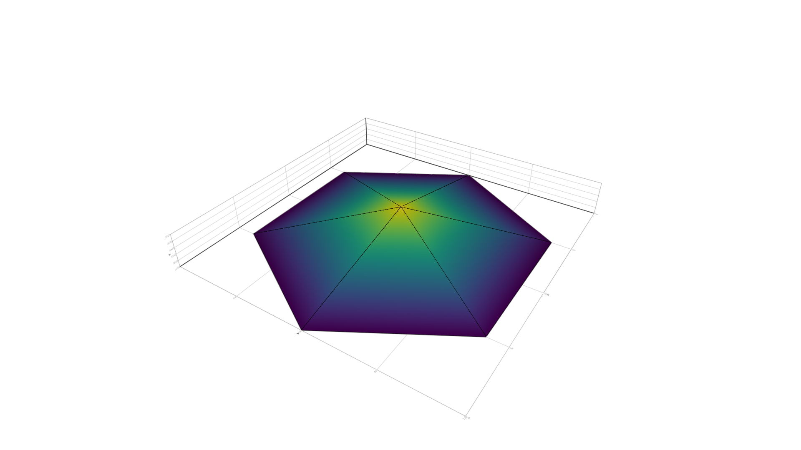

# Example

In [diffeq.jl](./diffeq.jl) is solved thee Poisson equation with multiple
roughness levels of triangulations.

To run this example you should make the following in the julia REPL, in the
examples directory

```julia-repl
julia> pwd()
"/home/user/DEC2D.jl/examples"

(@v1.5) pkg> add 'https://github.com/Suavesito-Olimpiada/DCE2D.jl'

julia> include("diffeq.jl")
```

This example is the one solved in Rafael Herrera et al. in [A geometric
description of Discrete Exterior Calculus for general
triangulations](https://www.scipedia.com/public/Herrera_et_al_2018b).

Here are the results for different triangulations

# Rough triangulation



# Medium triangulation


# Fine triangulation


